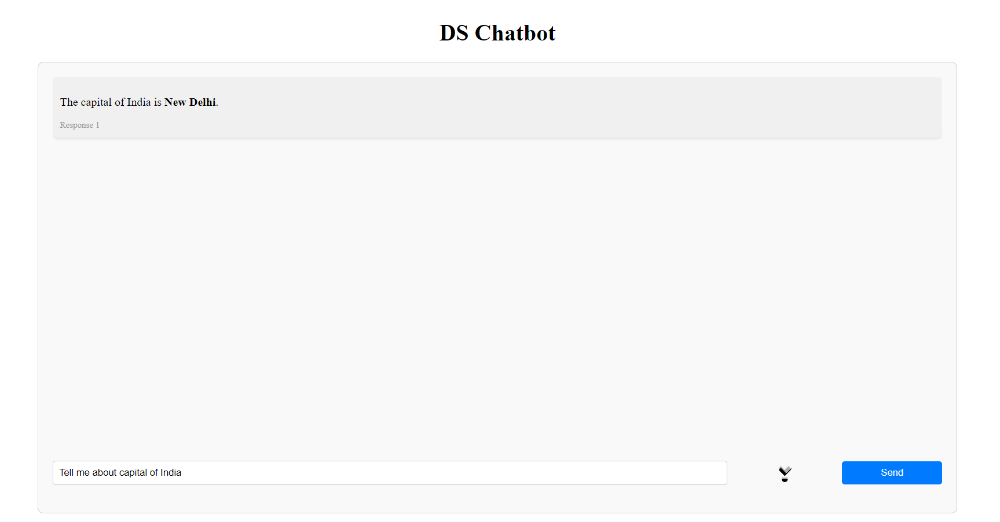
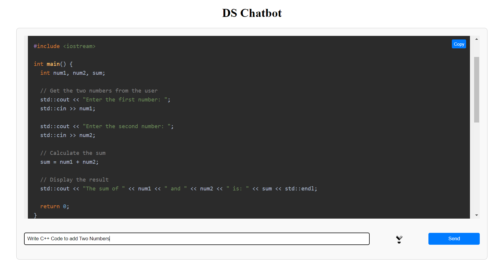
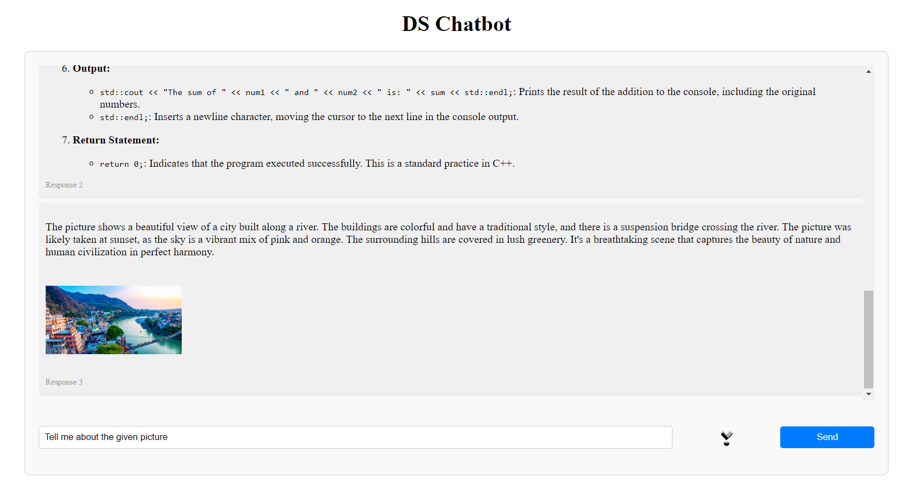

# Chatbot App

This is a simple chatbot application with a frontend built in React.js and a backend using Node.js and Express.js.

## Features

- Interactive chat interface
- Easy integration with backend services

## Getting Started

Follow these instructions to get a copy of the project up and running on your local machine for development and testing purposes.


## Clone the repository

```bash
git clone https://github.com/itsdheerajdp/DS-Chatbot.git
```


## Installing

### Backend
1. Navigate to the backend directory:
  ```bash
  cd backend
  ```
2. Install backend dependencies:
  ```bash
  npm install
  ```
3. Start the backend server:
  ```bash
  npm start
  ```

### Frontend
1. Navigate to the Frontend directory:
  ```bash
  cd frontend
  ```
2. Install frontend dependencies:
  ```bash
  npm install
  ```
3. Start the frontend development server:
  ```bash
  npm run dev
  ```
Visit http://localhost:5173/ in your browser to access the frontend.

## Screenshots

#### *This screenshot shows the chatbot responding to a basic user prompt.*


#### *This screenshot demonstrates the chatbot providing C++ code for adding two numbers.*


#### *This screenshot shows the chatbot interacting with image files uploaded by the user.*



